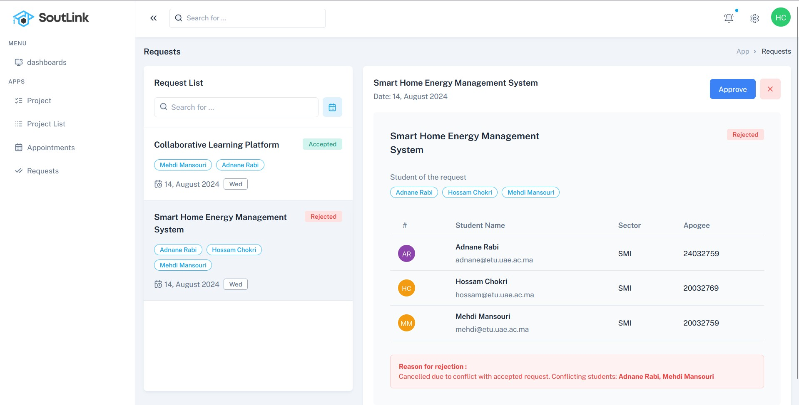

# Gestion des Projets de Fin d’Études (PFE)

## Description du Projet

Ce projet vise à développer une **application web** permettant de gérer les Projets de Fin d’Études (PFE). Elle offre un ensemble d'outils pour simplifier la gestion des documents, la communication entre encadrants et étudiants, ainsi que la planification des soutenances.

---

## Fonctionnalités

- **Gestion des Utilisateurs** :
  - Inscription des étudiants et des encadrants via une interface conviviale.
  - Authentification sécurisée.
  - Gestion des profils et des accès.

- **Gestion des Projets** :
  - Création et suivi des sujets de PFE par les encadrants.
  - Affichage des projets disponibles pour les étudiants.
  - Suivi des demandes et validations.

- **Planification des Soutenances** :
  - Prise de rendez-vous entre étudiants et encadrants.
  - Invitations pour les jurys.
  - Gestion des soutenances (notes, remarques, etc.).

---

## Captures d’Écran

### **Page de Connexion**

### **Inscription**

| Étudiants                          | Encadrants                           |
|------------------------------------|--------------------------------------|
|  |  |

### **la plateforme etudiant**

<table>
  <thead>
    <tr>
      <th>Page</th>
      <th>Description</th>
      <th>Aperçu</th>
    </tr>
  </thead>
  <tbody>
    <tr>
      <td><b>Page d’Accueil Étudiant</b></td>
      <td>Cette page offre une vue d’ensemble des projets disponibles et permet de naviguer facilement.</td>
      <td>
        
      </td>
    </tr>
    <tr>
      <td><b>Demandes de Projets</b></td>
      <td>Les étudiants peuvent soumettre des demandes pour des projets et suivre leur statut en temps réel.</td>
      <td>
        
      </td>
    </tr>
    <tr>
      <td><b>Planification de Rendez-vous</b></td>
      <td>Cette page permet de prendre des rendez-vous avec les encadrants et de gérer leur calendrier.</td>
      <td>
        
      </td>
    </tr>
  </tbody>
</table>

### **la plateforme encadrant**

<table>
  <thead>
    <tr>
      <th>Page</th>
      <th>Description</th>
      <th>Aperçu</th>
    </tr>
  </thead>
  <tbody>
    <tr>
      <td><b>Création de Projets</b></td>
      <td>Permet aux encadrants de créer des projets avec des descriptions détaillées et de définir les critères requis.</td>
      <td>
        
      </td>
    </tr>
    <tr>
      <td><b>Gestion des Demandes</b></td>
      <td>Les encadrants peuvent consulter et accepter ou rejeter les demandes des groupes d’étudiants.</td>
      <td>
        
      </td>
    </tr>
    <tr>
      <td><b>Planification de Rendez-vous</b></td>
      <td>Interface pour gérer les rendez-vous avec les étudiants et organiser des sessions de suivi.</td>
      <td>
        
      </td>
    </tr>
    <tr>
      <td><b>Invitation au Jury</b></td>
      <td>Outil pour inviter des membres de jury pour les soutenances des projets.</td>
      <td>
        
      </td>
    </tr>
  </tbody>
</table>

---

## Technologies Utilisées

- **Backend** : Spring Boot
- **Frontend** : Angular 
- **Base de Données** : MySQL
